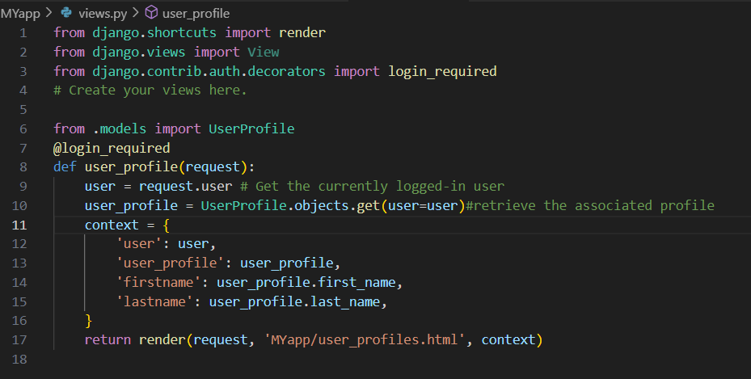
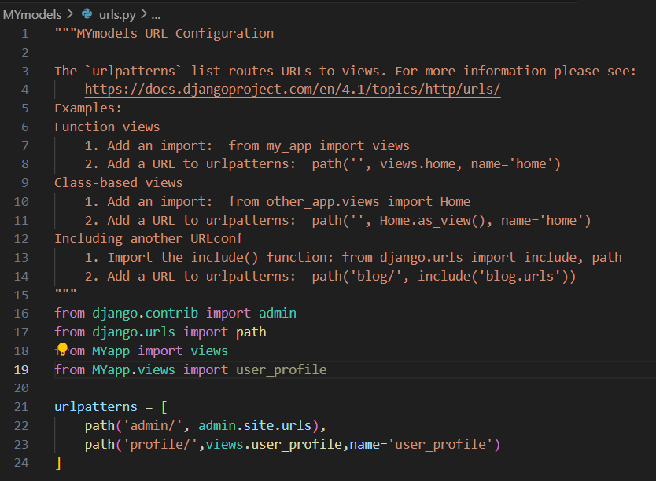
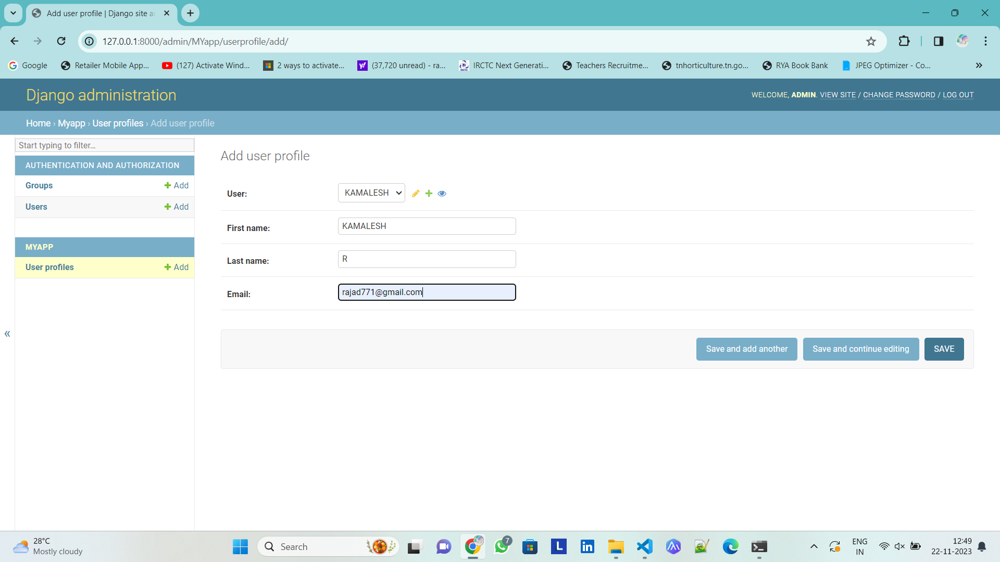

# Ex-04-Django-Models
# NAME: KAMALESH
# REF NO:23001711
# DEPARTMENT:AIDS

# AIM:
 TO CREATE DJANGO MODELS
# DESIGN PROCEDURE

Django models

step 1: Create django project and app using the following commands django-admin startproject mymodels python manage.py startapp myApp 

step 2: create a user_profile models in model.py 

add the models in the admin interface using the code admin.py

write a function based view to render the data from the models to the template in views

set up the url path for the templates urls.py

in settings.py add the appcreated

step 3: now do the migrations process to inititate and save the models

python manage.py makemigrations python manage.py migrate create a template as user_profile.html

step 4:run the program using the following command 

python manage.py runserver.py runserver 8000 in the admin page you can view the models created and in the user_profile template page you can see the profile page of the user

### output

.png>)
